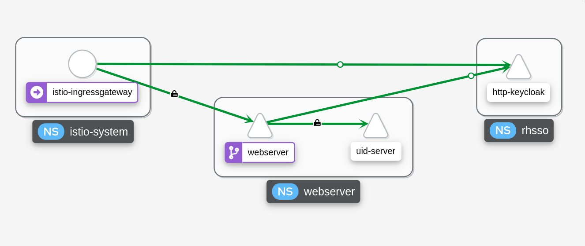

# Istio JWT Validation

This repository provides a demo application that demonstrates how istio (as part of Red Hat Service Mesh 2.x) can be used to initiate JWT introspection between a frontend and a backend server.

## Application Description

The application consists of two _python flask_ pods -

* A frontend server which accepts traffic from an istio ingress gateway and generates a JWT token using a thrird party Keycloak (Red Hat Single Sign On - RHSSO) server.
* A backend server which serves unique ids to the frontend instance. Istio protects the backend server by requiring a valid JWT token to be present when accessing any endpoint on the backend instance.

An overview of the traffic -



## Prerequisites

Before you can get started with application deployment, you must fullfil the next requirements -

`NOTE - The requirements in this section are only valid if you are deploying the application on Red Hat OpenShift Platform.`

### Keycloak (Red Hat Single Sign On)

A Keycloak instance must be present. To install Keycloak on OpenShift you may follow to [next guide](https://access.redhat.com/documentation/en-us/red_hat_single_sign-on/7.4/html/server_installation_and_configuration_guide/operator).

Configure a [Realm](https://access.redhat.com/documentation/en-us/red_hat_single_sign-on/7.5/html/server_administration_guide/configuring_realms#proc-creating-a-realm_server_administration_guide), a [Client](https://access.redhat.com/documentation/en-us/red_hat_single_sign-on/7.3/html/server_administration_guide/clients) and a [User](https://access.redhat.com/documentation/en-us/red_hat_single_sign-on/7.5/html/server_administration_guide/assembly-managing-users_server_administration_guide#proc-creating-user_server_administration_guide) on the Keycloak instance.

You must be able to provide -

* The keycloak server hostname (e.g - keycloak-keycloak.apps.example.com)
* A realm name (e.g - myrealm)
* A client id (e.g - flask-app)
* A client secret (e.g - 49ef7a38-113d-4fcf-a812-1d9ebf254ea4)

### Service Mesh

Red Hat Service Mesh has to be installed and configured. Follow the official Red Hat documentation for [Service Mesh installation](https://docs.openshift.com/container-platform/4.6/service_mesh/v2x/preparing-ossm-installation.html).

Make sure to create the next resources to complete initializing Service Mesh on your cluster -

* Namespace - create a namespace for your application to run in. A resource example can be found [here](k8s/ocp-operators/app-namespace.yaml)
* ServiceMeshControlPlane - used for initiating all Service Mesh pods. A resource example can be found [here](k8s/ocp-operators/smcp.yaml).
* ServiceMeshMemberRoll - used for enrolling your Namespace into Service Mesh. A resource example can be found [here](k8s/ocp-operators/smmr.yaml). Make sure to modify the namespace name before applying the example resource!

## Application Deployment

The application deployment is done via a Helm chart. Make sure to install the [helm binary](https://helm.sh/docs/intro/install/) on your workstation before you continue.

To deploy the application, clone the repository by running the next command - 

```
$ git clone https://github.com/michaelkotelnikov/istio-jwt-validation.git
```

Modify the values.yaml file at [istio-jwt-validation/k8s/flask-oidc/values.yaml](k8s/flask-oidc/values.yaml). Provide the correct Keycloak values in order for the application to authenticate against your Keycloak instance, realm and client.

Install the helm chart with the modified values by running the next command -

```
$ helm install --generate-name --namespace <application-namespace>  istio-jwt-validation/k8s/flask-oidc
```

Make sure that the application is running by performing the next commands -

```
$ oc get pods -n <application-namespace>
NAME                          READY   STATUS    RESTARTS   AGE
uid-server-6d7c6d4f9c-lnh2t   2/2     Running   2          1m
webserver-6688d85d4-zclnq     2/2     Running   2          1m

$ export GATEWAY_URL=$(oc -n istio-system get route istio-ingressgateway -o jsonpath='{.spec.host}')

$ curl $GATEWAY_URL
Welcome anonymous, <a href="/private">Log in</a>
```

You may now navigate to the application route from your browser and check the Keycloak integration.

## JWT Validation

By default, the backend server is not validating JWTs and authorization headers. The application configures a JWT token validation mechanism using istio's _RequestAuthentication_ resource. To check that token validation is working properly, run the next commands from a pod in the OpenShift cluster -

1. A request with no authorization headers -

```
$ curl http://uid-server.<application-namespace>.svc:8080/id
HTTP/1.1 403 Forbidden
```

2. A request with an invalid JWT token -
```
$ curl http://uid-server.webserver.svc:8080/id -H "Authorization: Bearer <token>"
HTTP/1.1 401 Unauthorized
www-authenticate: Bearer realm="http://uid-server.webserver.svc:8080/id", error="invalid_token"
```

3. A request with an expired JWT token -
```
$ curl http://uid-server.webserver.svc:8080/id -H "Authorization: Bearer <token>"
HTTP/1.1 401 Unauthorized
www-authenticate: Bearer realm="http://uid-server.webserver.svc:8080/id", error="invalid_token"
```

4. A request with a valid JWT token -
```
curl http://uid-server.webserver.svc:8080/id -H "Authorization: Bearer <token>" -I
HTTP/1.1 200 OK
```

## Application Development

To build your own instance of the application follow the next steps. Do not build your own instance unless it's for development purposes.

### Frontend

Note - a prebuilt image can be found at the next image [registry](https://hub.docker.com/r/mkotelni/oidc-flask).

To build your own instance, run the next commands - 
```
$ git clone https://github.com/michaelkotelnikov/istio-jwt-validation.git

$ cd istio-jwt-validation/app/frontend

$ docker build -t oidc-flask:latest .
```

### Backend

Note - a prebuilt image can be found at the next image [registry](https://hub.docker.com/r/mkotelni/uid-flask).

To build your own instance, run the next commands -
```
$ git clone https://github.com/michaelkotelnikov/istio-jwt-validation.git

$ cd istio-jwt-validation/app/backend

$ docker build -t uid-flask:latest .
```